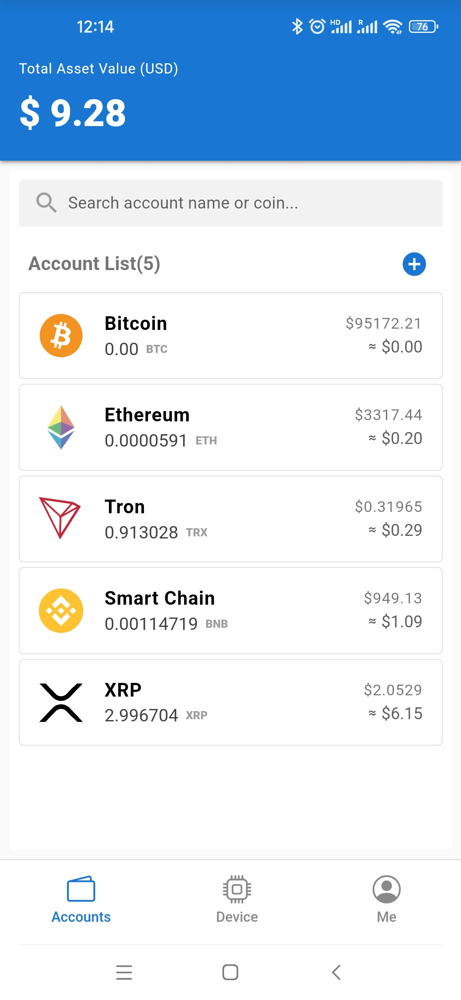
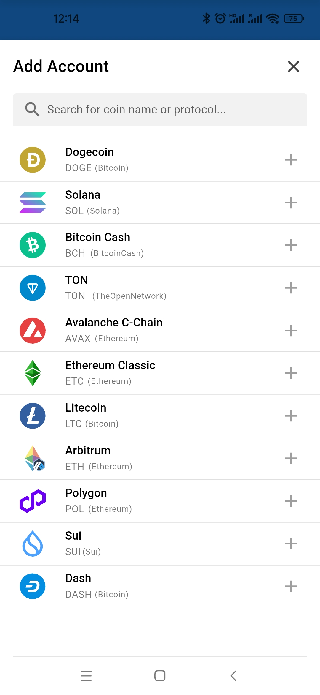
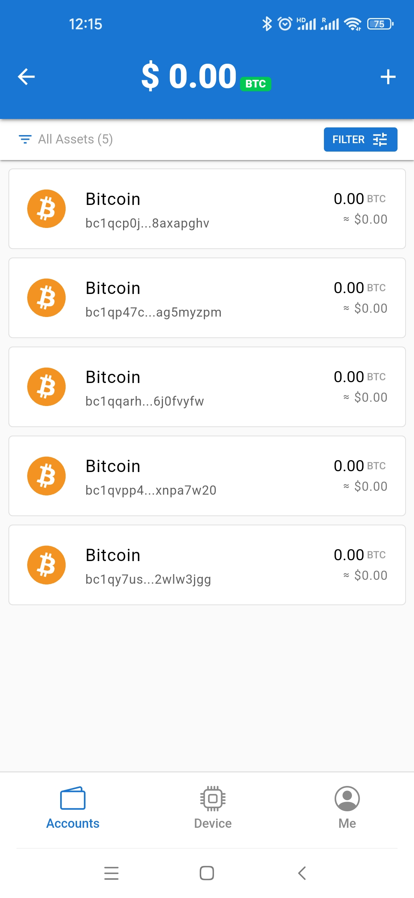
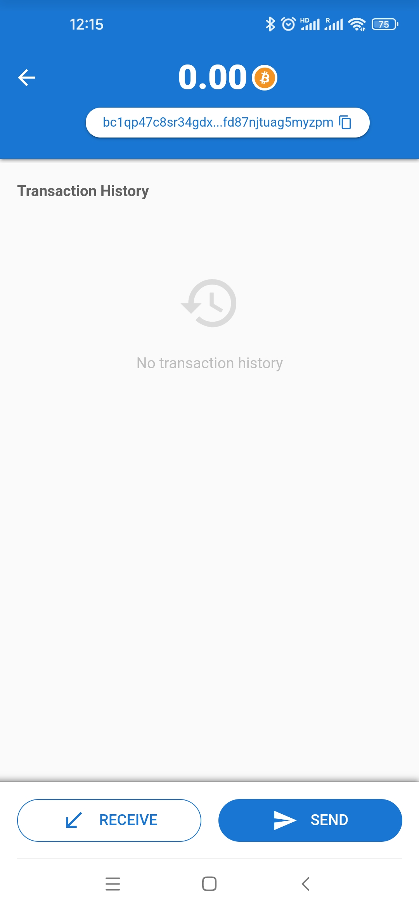
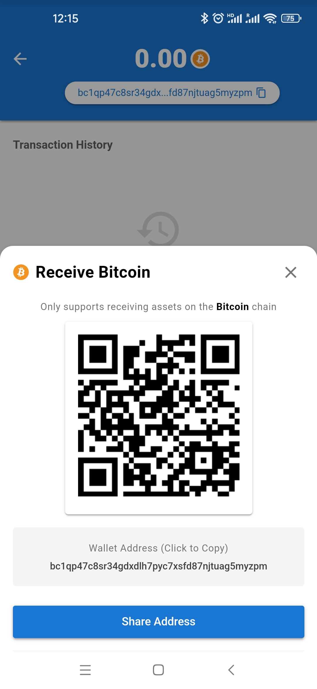
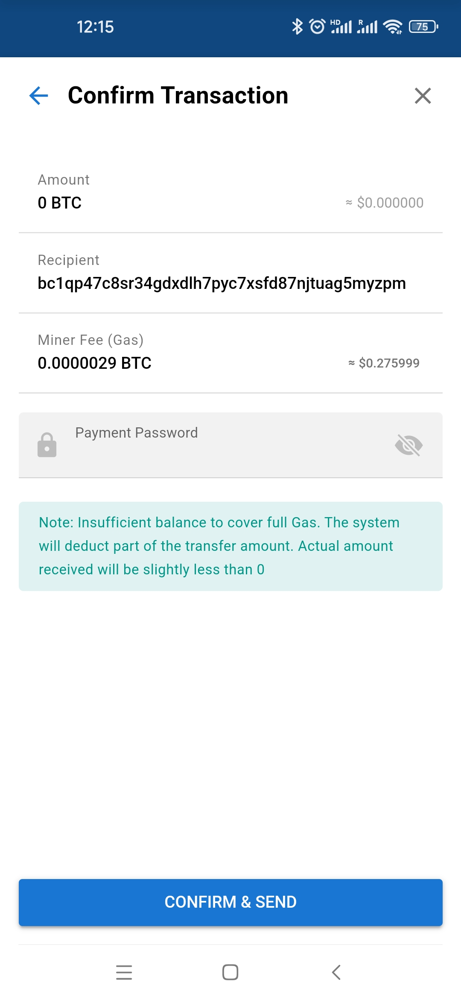
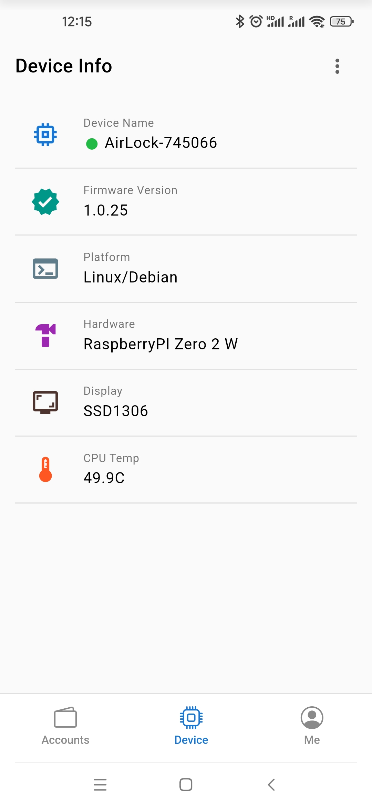
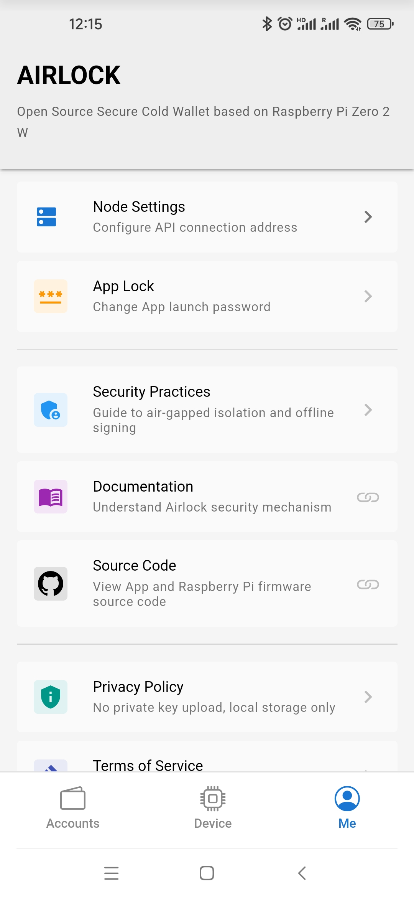

# App Installation & Build Guide

[中文](../zh/app.md)

**Airlock App** is the companion mobile application for the Airlock Hardware Cold Wallet. Acting as a "watch-only wallet," it handles online balance queries, transaction construction, and broadcasting, without ever touching the user's private keys.

This project is built on **Vue.js 3** + **Quasar Framework** and wrapped natively using **Apache Cordova**. It communicates with the Airlock hardware via Bluetooth Low Energy (BLE) in an air-gapped environment.

<p align="center">
  
  
  
  
  
  
  
  
</p>

---

## Fast Track (Download & Install)

If you do not need to modify the code, we recommend downloading the pre-built installer directly.

### Android Users
* **Download APK**: [Go to Releases Page](https://github.com/airlock-wallet/airlock/releases)
* **Compatibility**: Android 10.0 and above.

### iOS Users
Due to Apple App Store limitations, we cannot provide a direct installation package at this time. iOS users currently need an Apple Developer account and must compile and install the app manually by following the "Geek Mode" instructions below.

---

## Geek Mode (Build from Source)

This section is for developers or users who wish to verify the code security themselves.

### 1. Prerequisites

**WARNING: Compilation failures are usually due to incomplete environment configuration. Please check the following requirements carefully.**

* **Node.js**: v18 LTS or v20 LTS recommended.
* **Java Development Kit (JDK)**: **JDK 17** is **mandatory** for Android compilation. Please ensure the `JAVA_HOME` environment variable is configured.
* **Gradle**: v8.0 or higher recommended.
* **Android Studio**:
    * Install Android SDK Platform (API Level 33/34).
    * **CRITICAL**: In SDK Tools, you must check and install **Android SDK Command-line Tools**.
    * Configure the `ANDROID_HOME` environment variable to point to your SDK root directory.

### 2. Get the Code

Since this project uses a Monorepo structure, please clone the complete repository and navigate to the App directory.

```bash
# 1. Clone the repository
git clone https://github.com/airlock-wallet/airlock.git

# 2. Enter App source directory
cd airlock/app

```

### 3. Install Dependencies

```bash
# Install Quasar CLI and Cordova globally
npm install -g @quasar/cli cordova

# Install project dependencies
npm install

```

### 4. Initialize Native Environment

Quasar handles most Cordova configurations automatically, but for the first run, it is recommended to manually add target platforms to ensure the environment is detected correctly.

```bash
# Enter Cordova subdirectory
cd src-cordova

# Install Cordova dependencies (Crucial for plugins)
npm install

# Add Android platform
cordova platform add android

# (Optional) Add iOS platform - macOS only
# cordova platform add ios

# Return to App root directory
cd ..

```

### 5. Debug & Build

**Real Device Debugging (Recommended)**
Since the app relies on Bluetooth (BLE) hardware calls, browser mode cannot fully test functionality. **It is strongly recommended to connect a physical device for debugging.**

#### Android Real Device Debugging

Ensure your phone has "Developer Options" and "USB Debugging" enabled, and is connected to your computer.

```bash
# Add -- --device argument to force running on physical device
quasar dev -m cordova -T android -- --device

```

#### iOS Real Device Debugging (Critical Steps)

iOS debugging is more complex than Android because Apple requires apps to be signed to run on physical devices. Please strictly follow these steps:

**Step 1: Generate Xcode Project**
Run the Quasar dev command once to generate the iOS project files in the `src-cordova` directory.

```bash
quasar dev -m cordova -T ios

```

*Note: If this is the first run, the terminal may report "Signing for ... requires a development team". This is normal; please proceed to the next step.*

**Step 2: Configure Signing**

1. Open macOS **Finder** and navigate to `airlock/app/src-cordova/platforms/ios/`.
2. Double-click to open **`AirLock.xcworkspace`**. This will launch Xcode.
    * **WARNING**: Do **NOT** open the `AirLock.xcodeproj` (blue icon) file. Doing so will fail to load third-party plugin dependencies, and compilation will fail!


3. In the Xcode left navigation bar, click on the root project node.
4. Select the **Signing & Capabilities** tab.
5. In the **Team** dropdown menu, select your Apple ID (Personal Team). If using for the first time, log in via Xcode -> Settings -> Accounts.

**Step 3: Run & Trust**

1. Keep your iPhone connected. In the Xcode top device bar, select your iPhone.
2. Click the **Play (Run)** button in the top left corner of Xcode.
3. **Trust Certificate**: After the app is installed, the first launch will prompt "Untrusted Developer".
    * On your iPhone, go to: **Settings -> General -> VPN & Device Management**.

    * Click your developer account and select **"Trust"**.


4. Tap the App icon again to start debugging.

---

**Release Build**
This generates the final APK or IPA installation file.

```bash
# Build Android APK
# Output path usually: dist/cordova/android/apk/release/
quasar build -m cordova -T android

# Build iOS IPA
# Recommended: Use Product -> Archive in Xcode to package and distribute
quasar build -m cordova -T ios

```

> **Note**: The first compilation requires downloading a large number of Maven/Gradle dependencies. Please ensure your network environment can access Google Maven repositories smoothly.

---

## Service Limitations

To maintain the project as free and open-source, the App connects to Public RPC Nodes by default.

* **Rate Limits**: Public nodes often have Requests Per Second (RPS) limits. Under high concurrency, balance refreshes or transaction broadcasting may occasionally time out.
* **Privacy Note**: Although your private keys never leave the cold wallet, RPC node providers may see your IP address and the wallet addresses you query. If you prioritize ultimate privacy, please refer to the [Backend Service Deployment Guide](https://www.google.com/search?q=../en/service.md) to set up a private node.

---

## Troubleshooting

If you encounter errors during compilation, please refer to these common solutions:

1. **JDK Version Error**:
    * Error: `Requirements check failed for JDK 17`
    * Solution: Run `java -version` to verify the version is 17.


2. **SDK Not Found**:
    * Error: `Android SDK not found`
    * Solution: Check if the `ANDROID_HOME` environment variable is set correctly and the SDK directory contains `cmdline-tools`.


3. **Gradle Missing**:
    * Error: `Could not find an installed version of Gradle`
    * Solution: Android Studio usually downloads Gradle automatically. If it fails, manually download it and add it to your PATH.


---

## Disclaimer

* **Software Provided "AS IS"**: This software is an open-source experimental project with no express or implied warranties.
* **Use at Your Own Risk**: Users assume all risks associated with using this software. The developers are not liable for any asset losses caused by insecure mobile environments (e.g., Jailbroken/Rooted devices), operational errors, or force majeure.
* **Compliance**: Users are responsible for ensuring their use of this software complies with local laws and regulations.