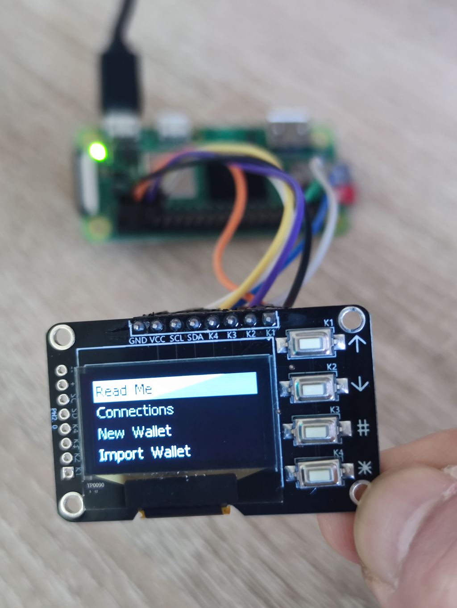
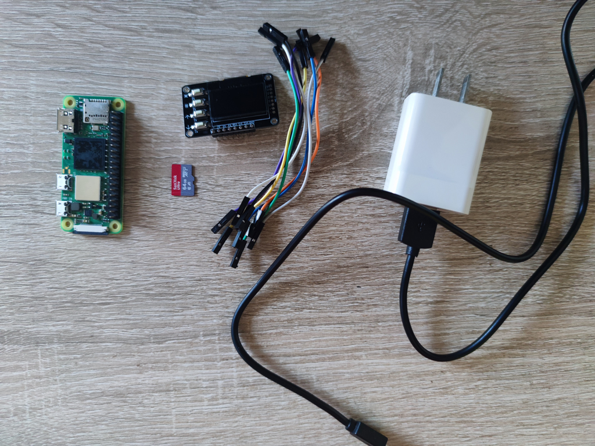
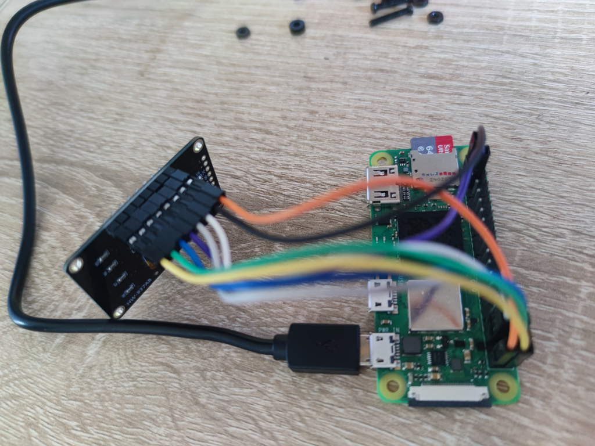

# Hardware Assembly & Flashing Guide

[中文](../zh/hardware.md)

**Airlock** is an open-source, secure cold wallet built on the Raspberry Pi Zero 2 W. It operates in a completely air-gapped environment, communicating offline with the mobile app via Bluetooth, ensuring your private keys never touch the internet.

This guide will walk you through assembling and running an Airlock hardware wallet from scratch.

<p align="center">
  
</p>

---

## Video Tutorial (Coming Soon)

> Assembly video is currently in production...

---

## Step 1: Hardware Bill of Materials (BOM)

Before you begin, ensure you have the following components. The total cost is approximately $20 - $25 USD.

| Component | Specification/Recommendation | Note |
| :--- | :--- | :--- |
| **Core Unit** | **Raspberry Pi Zero 2 W** | Buy the header version (WH) for ease; **buy the headerless version for minimal size.** |
| **Display** | **SSD1306 OLED (0.96")** | Must be **I2C Interface** (4 pins: VCC, GND, SDA, SCL). |
| **Storage** | **MicroSD Card** | 8GB or larger. SanDisk or Samsung Class 10 recommended. |
| **Controls** | 4 Tactile Buttons | Or use an existing OLED HAT (check pin definitions). |
| **Input** | USB Physical Keyboard | **Required for initialization only**, removable for daily use. |
| **Power** | 5V MicroUSB Cable | Standard phone charger or power bank. |
| **Wiring** | Dupont or Thin Wires | For connecting the screen and buttons. |

<p align="center">
  
</p>

**As shown, the required components are minimal. The modular design makes preparation clear without needing complex electronics knowledge.**

---

## Step 2: Hardware Assembly

Please connect the wires strictly according to the table below. Incorrect connections may prevent the device from booting or the screen from lighting up.

### GPIO Wiring Definition

| Module | Pin Name | Pi GPIO (BCM) | Physical Pin |
| :--- | :--- | :--- | :--- |
| **OLED Screen** | VCC | 3.3V | Pin 1 |
| | GND | GND | Pin 6 |
| | **SDA** | **GPIO 19** | Pin 35 |
| | **SCL** | **GPIO 13** | Pin 33 |
| **Buttons** | **UP** | **GPIO 21** | Pin 40 |
| | **DOWN** | **GPIO 20** | Pin 38 |
| | **ENTER** | **GPIO 16** | Pin 36 |
| | **ESC** | **GPIO 3** | Pin 5 |

<p align="center">
  
</p>

**Only a few core wires are needed. The clean wiring leaves ample space for designing ultra-thin 3D printed cases.**

> **Volume Optimization Tip**: If you want to minimize the device size (e.g., to credit card size), **we strongly recommend buying the Raspberry Pi without headers** and soldering wires directly to the pads. Direct soldering significantly reduces thickness compared to using jumper wires.

---

## Step 3: System Installation

We provide two installation methods to meet different user needs. **Please choose one:**

### Option A: Flash Pre-built Image (Recommended)
Suitable for most users. No coding required, download and play.

1.  **Download Image**: Go to the [Releases Page](https://github.com/airlock-wallet/airlock/releases) and download the latest `airlock-os-v1.0.0.img.xz`.
2.  **Download Tool**: Install [Raspberry Pi Imager](https://www.raspberrypi.com/software/).
3.  **Flash**:
    * Open Imager.
    * Click "CHOOSE OS" -> Scroll down to "Use Custom" -> Select the `.img.xz` file you just downloaded.
    * Click "CHOOSE STORAGE" -> Select your SD card.
    * Click "NEXT" -> **Select "No, don't apply settings"** (Crucial) -> Start flashing.
4.  **Finish**: Insert the card into the Raspberry Pi and power it on.

---

### Option B: Build from Source (Developer)
Suitable for users who want to audit code, customize the system, or do not trust pre-built images.

#### 1. Prepare Base System
* Download and flash the official **Raspberry Pi OS Lite (64-bit)**.
* Configure SSH connection for subsequent operations.

#### 2. System Initialization
SSH into the Raspberry Pi and run the following commands:

```bash
# Create user 'airlock'
sudo useradd -m -s /bin/bash airlock
sudo usermod -aG sudo,video,gpio,i2c airlock
sudo passwd airlock

# Install system dependencies
sudo apt update
sudo apt install -y vim build-essential bluetooth bluez bluez-tools i2c-tools gpiod \
python3-libgpiod python3-gpiozero python3-pil python3-smbus rng-tools5 \
libdbus-1-dev libglib2.0-dev pkg-config python3-dev nodejs npm swig \
liblgpio-dev pi-bluetooth python3-lgpio git

```

#### 3. Bus Configuration

Edit `/boot/firmware/config.txt` (or `/boot/config.txt` on older versions) and add under `[all]`:

```ini
[all]
# Enable software I2C on SDA=19, SCL=13
dtoverlay=i2c-gpio,i2c_gpio_sda=19,i2c_gpio_scl=13,bus=3

```

#### 4. Deploy Code

```bash
su - airlock

# 1. Clone the entire repository (Monorepo)
git clone [https://github.com/airlock-wallet/airlock.git](https://github.com/airlock-wallet/airlock.git)

# 2. Enter hardware directory (Crucial!)
cd airlock/hardware

# 3. Create virtual environment
python3 -m venv venv
source venv/bin/activate

# 4. Install Python dependencies
pip install -r requirements.txt

# 5. Install Node.js dependencies (for encryption worker)
cd js
npm install

# Exit airlock user
exit

```

#### 5. Configure Systemd Service

Create `/etc/systemd/system/airlock.service`:

```ini
[Unit]
Description=Airlock Hardware Wallet Service
After=multi-user.target network.target bluetooth.target
StartLimitIntervalSec=0

[Service]
Type=simple
# Core start command (Monorepo path)
ExecStart=/home/airlock/airlock/hardware/venv/bin/python /home/airlock/airlock/hardware/main.py

# Shutdown script
ExecStop=/home/airlock/airlock/hardware/venv/bin/python /home/airlock/airlock/hardware/shutdown.py

# Ensure Python logs are unbuffered
Environment=PYTHONUNBUFFERED=1

# Process management
KillMode=control-group
Restart=always
RestartSec=5

# Permissions
User=airlock
Group=airlock
WorkingDirectory=/home/airlock/airlock/hardware

[Install]
WantedBy=multi-user.target

```

Enable the service: `sudo systemctl enable airlock`

#### 6. Security Hardening (Firewall)

**This is the most critical step for manual builds:**

```bash
sudo ufw default deny incoming
sudo ufw default deny outgoing  # Block ALL outgoing traffic (Prevent key leakage)
sudo ufw allow from 192.168.0.0/16 to any port 22 # Allow local SSH only
sudo ufw enable

```

---

## Core Security Mechanisms

Whether you choose Option A or B, please adhere to the following security guidelines:

1. **Mandatory 25th Word (BIP39 Passphrase)**
* **Supply Chain Attack Prevention**: Airlock **mandates** the use of a Passphrase.
* Even if your 24-word seed is captured by a hidden camera, hackers cannot steal your assets without the "25th word" in your mind.


2. **Physical Keyboard Required for Initialization**
* **Initialization Security**: You **must connect a USB physical keyboard** when generating or importing a wallet.
* This prevents any potential sniffing risks during Bluetooth transmission. The keyboard can be removed after initialization.


3. **Backup Warning**
* You must physically backup both the **[12/24-word Seed]** and the **[Passphrase]**.
* **Warning**: If you lose the Passphrase, your assets are permanently lost.


---

## Disclaimer

* **Software Provided "AS IS"**: Airlock is an open-source experimental project with no express or implied warranties.
* **Use at Your Own Risk**: The developers are not liable for asset losses caused by hardware failure, user error (e.g., forgetting passwords), or force majeure.
* **Don't Trust, Verify**: We believe in self-custody. Please audit the code yourself whenever possible.