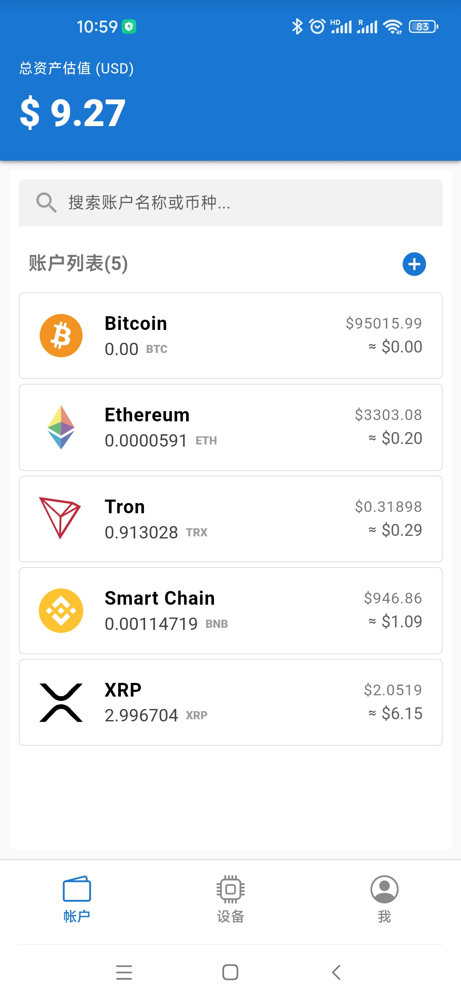
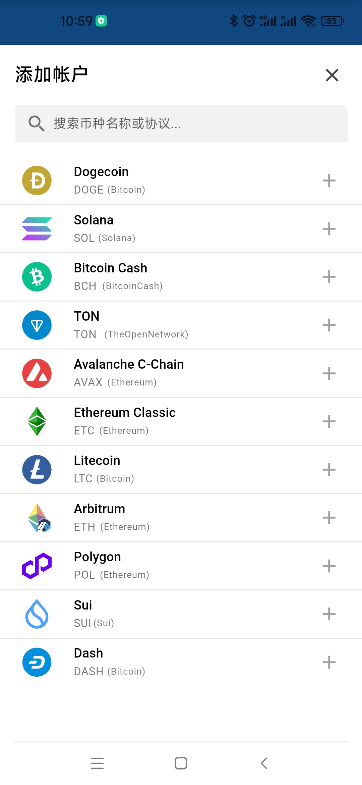
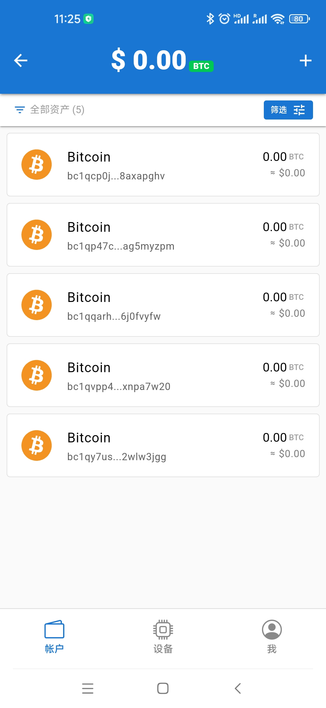
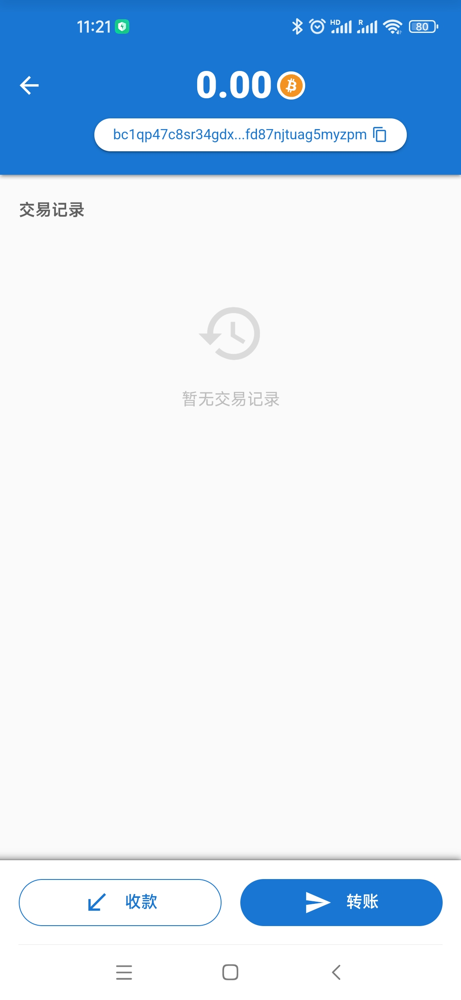
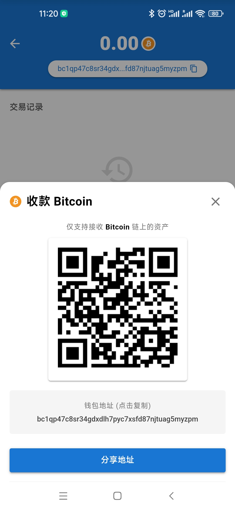
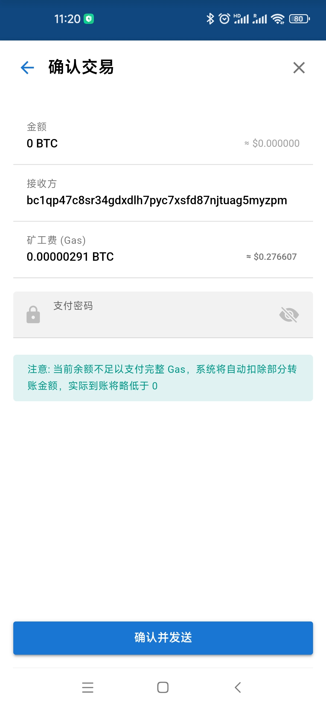
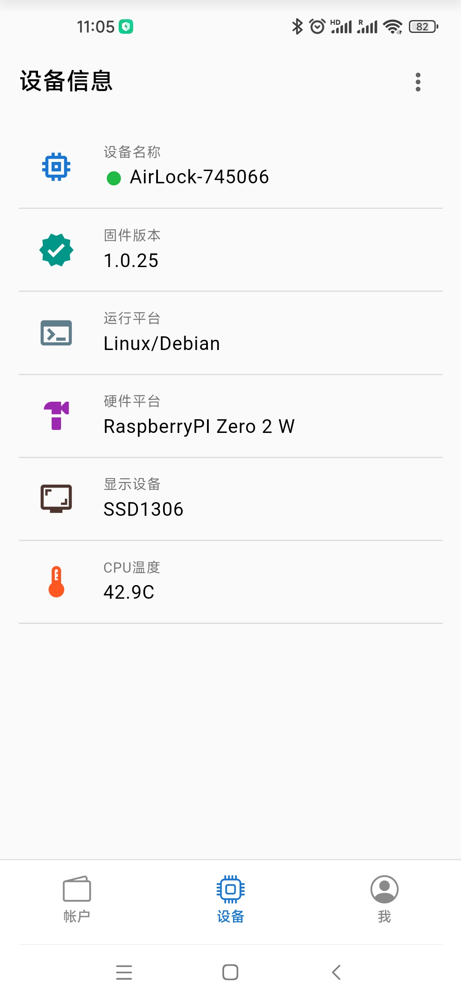
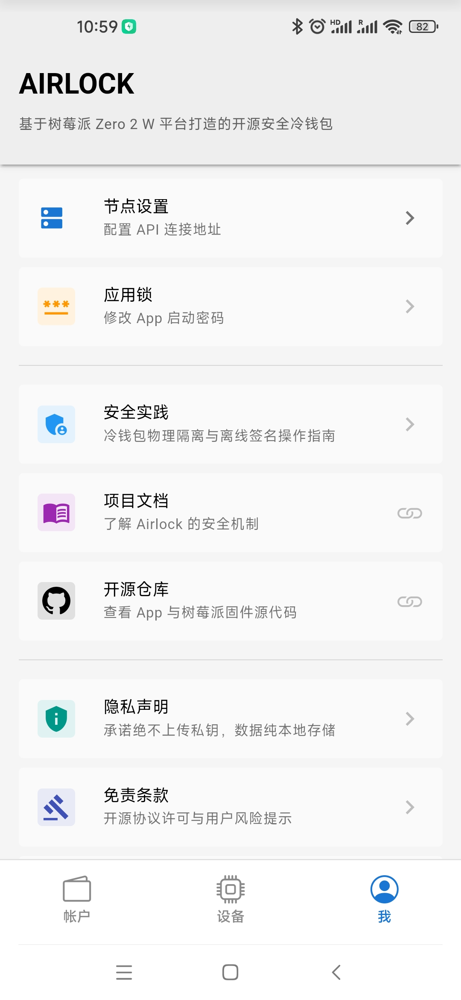

# App 安装与编译指南

[English](../en/app.md)

**Airlock App** 是 Airlock 硬件冷钱包的配套手机应用。作为“观察钱包”，它负责联网查询余额、构建交易和广播签名，全过程不接触用户的私钥。

本项目基于 **Vue.js 3** + **Quasar Framework** 构建，并使用 **Apache Cordova** 进行原生封装。它通过低功耗蓝牙 (BLE) 与 Airlock 硬件进行气隙通信。

<p align="center">
  
  
  
  
  
  
  
  

</p>

---

## 极速通道 (下载安装)

如果您不需要修改代码，建议直接下载预编译的安装包。

### Android 用户
* **下载 APK**: [前往 Releases 页面下载最新版](https://github.com/airlock-wallet/airlock/releases)
* **兼容性**: Android 10.0 及以上版本。

### iOS 用户
由于 Apple App Store 的限制，我们暂时无法提供直接安装包。iOS 用户目前需要拥有 Apple 开发者账号，并参考下方的“极客模式”自行编译安装。

---

## 极客模式 (源码编译)

本部分适用于开发者或希望自行验证代码安全性的用户。

### 1. 开发环境准备 (Prerequisites)

**警告：编译失败通常是因为环境配置不完整，请仔细检查以下要求。**

* **Node.js**: 推荐安装 v18 LTS 或 v20 LTS。
* **Java Development Kit (JDK)**: Android 编译**必须**安装 **JDK 17**。请配置好 `JAVA_HOME` 环境变量。
* **Gradle**: 推荐安装 v8.0 或更高版本。
* **Android Studio**:
    * 安装 Android SDK Platform (API Level 33/34)。
    * **关键**: 在 SDK Tools 中必须勾选安装 **Android SDK Command-line Tools**。
    * 配置环境变量 `ANDROID_HOME` 指向 SDK 根目录。

### 2. 获取代码

由于本项目采用 Monorepo 结构，请克隆完整仓库并进入 App 目录。

```bash
# 1. 克隆仓库
git clone https://github.com/airlock-wallet/airlock.git

# 2. 进入 App 源码目录
cd airlock/app

```

### 3. 安装依赖

```bash
# 全局安装 Quasar CLI 和 Cordova
npm install -g @quasar/cli cordova

# 安装项目依赖
npm install

```

### 4. 初始化原生环境

Quasar 会自动处理大部分 Cordova 配置，但在首次运行时，建议手动添加目标平台以确保环境检测正确。

```bash
# 进入 Cordova 子目录
cd src-cordova

# 安装 Cordova 依赖
npm install

# 添加 Android 平台
cordova platform add android

# (可选) 添加 iOS 平台 - 仅限 macOS
# cordova platform add ios

# 返回 App 根目录
cd ..

```

### 5. 调试与构建

**真机调试 (推荐)**
由于应用依赖蓝牙 (BLE) 硬件调用，浏览器模式无法完整测试功能，**强烈建议连接真机进行调试**。

#### Android 真机调试

请确保手机已开启“开发者模式”及“USB 调试”，并连接电脑。

```bash
# 添加 -- --device 参数以强制运行在物理设备上
quasar dev -m cordova -T android -- --device

```

#### iOS 真机调试 (关键步骤)

iOS 调试相比 Android 更为复杂，因为 Apple 强制要求应用必须经过签名才能在真机运行。请严格按照以下步骤操作：

**第一步：生成 Xcode 工程**
先运行一次 Quasar 开发命令，让其在 `src-cordova` 目录下生成 iOS 工程文件。

```bash
quasar dev -m cordova -T ios

```

*注意：如果是首次运行，终端可能会报错提示“Signing for ... requires a development team”，这是正常的，请继续下一步。*

**第二步：配置签名 (Signing)**

1. 打开 macOS 的 **Finder**，进入项目目录 `airlock/app/src-cordova/platforms/ios/`。
2. 双击打开 **`AirLock.xcworkspace`**，这将启动 Xcode。
* **警告**：请**不要**打开 `AirLock.xcodeproj` (蓝色图标) 文件，否则会导致第三方插件依赖无法加载，编译必定失败！
3. 在 Xcode 左侧导航栏点击项目根节点。
4. 选择 **Signing & Capabilities** 选项卡。
5. 在 **Team** 下拉菜单中，选择您的 Apple ID (Personal Team)。如果是第一次使用，需要先在 Xcode -> Settings -> Accounts 中登录。

**第三步：运行与信任**

1. 保持 iPhone 连接电脑，在 Xcode 顶部设备栏选择您的 iPhone。
2. 点击 Xcode 左上角的 **Play (运行)** 按钮。
3. **信任证书**：应用安装到手机后，首次点击会提示“不受信任的开发者”。
* 请在 iPhone 上打开：**设置 (Settings) -> 通用 (General) -> VPN 与设备管理 (VPN & Device Management)**。
* 点击您的开发者账号，选择 **“信任 (Trust)”**。


4. 再次点击 App 图标即可启动调试。

---

**构建发布包 (Release)**
这将生成最终的 APK 或 IPA 安装文件。

```bash
# 构建 Android APK
# 输出路径通常在: dist/cordova/android/apk/release/
quasar build -m cordova -T android

# 构建 iOS IPA
# 建议在 Xcode 中执行 Product -> Archive 进行打包发布
quasar build -m cordova -T ios

```
> **注意**: 首次编译需要下载大量的 Maven/Gradle 依赖，请确保您的网络环境可以顺畅访问 Google Maven 仓库。

---

## 服务限制说明

为了维持项目的免费开源，App 默认连接的是公共区块链节点 (Public RPC Nodes)。

* **速率限制**：公共节点通常有每秒请求数 (RPS) 限制。在高并发情况下，余额刷新或转账广播可能会偶发超时。
* **隐私说明**：虽然您的私钥从未离开冷钱包，但 RPC 节点提供商可能会看到您的 IP 地址和查询的钱包地址。如果您追求极致隐私，请参考 [后端服务部署指南](../zh/service.md) 搭建私有节点。

---

## 故障排除

如果您在编译过程中遇到报错，请参考以下常见解决方案：

1. **JDK 版本错误**:
* 报错: `Requirements check failed for JDK 17`
* 解决: 运行 `java -version` 确认版本为 17。


2. **SDK 找不到**:
* 报错: `Android SDK not found`
* 解决: 检查 `ANDROID_HOME` 环境变量是否设置正确，且 SDK 目录中包含 `cmdline-tools`。


3. **Gradle 缺失**:
* 报错: `Could not find an installed version of Gradle`
* 解决: Android Studio 通常会自动下载 Gradle，如果失败，请手动下载并添加到 PATH。


---

## 免责声明

* **软件按“原样”提供**：本软件是开源实验性项目，没有任何形式的明示或暗示担保。
* **风险自负**：用户需自行承担使用本软件的所有风险。对于因手机环境不安全（如已越狱/Root）、操作失误、或不可抗力导致的资金损失，开发者不承担法律责任。
* **合规性**：请用户自行确保使用本软件符合当地法律法规。
